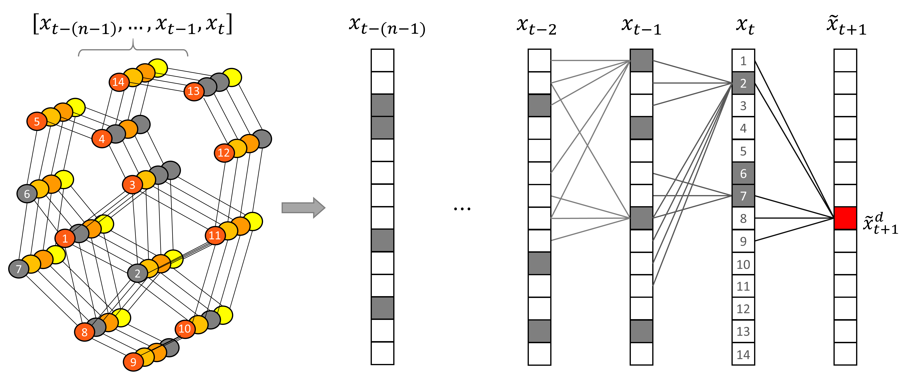

# Graph Markov Network for Traffic Forecasting with Missing Data
> Code for this post: [Graph Markov Network for Traffic Forecasting with Missing Data](https://zhiyongcui.com/blog/2020/07/16/graph-markov-network.html) 
##### Table of Contents
* [Introduction](#introduction)
* [Usage](#usage)
     * [Requirements](#requirements)
     * [Data Preparation](#data-preparation)
     * [Run Jupyter Scripts for Demonstration](#run-jupyter-scripts-for-demonstration)
     * [Run Python Scripts for Experiments](#run-python-scripts-for-experiments)
* [Reference](#reference)
* [Citation](#citation)

<!-- ## Before Introduction
The ideas, methodologies, and implementations of the Graph Markov Network is quite simple! 
-->

## Introduction
This is the github repo for sharing the code for implementing the Graph Markov Network (GMN) proposed in [1]. The GMN is proposed to solve the traffic forecasting problems while the traffic data has missing values. The Graph Markov Model is designed based on the Graph Markov Process (GMP), which provides a new perspective to model the transition process of the spatial-temporal data. 

The idea of GMN is very simple and easy to be implemented. The structure of GMN is similar to the autoregressive model and recurrent neural networks. The difference is that GMN takes the spatial structure of the data (network-wide traffic states) as a graph and attempts to infer missing values from the values of neighboring nodes in the graph. The following figure demonstrates the GMP structure. The gray-colored nodes in the left demonstrate the nodes with missing values. Vectors on the right side represent the traffic states. The traffic states at time _t_ are numbered to match the graph and the vector. The future state (in red color) can be inferred from their neighbors at previous time steps.

<p align="left"></p>

For most details, you can refer to the paper \[[TR Part C](https://www.sciencedirect.com/science/article/pii/S0968090X20305866)\] or \[[arXiv](https://arxiv.org/abs/1912.05457)\].

The ideas and the methodologies of GMP and GMN are detailed in this **[Post](https://zhiyongcui.com/blog/2020/07/16/graph-markov-network.html)**.

## Usage

### Requirements

* PyTorch >= 1.1.0
* NumPy
* Pandas

The requirements.txt listed the required packages.

### Data Preparation

Three datasets are used to test the GMN in the experiments
<!-- :
* PEMS-BAY: This dataset named as PEMS-BAY is collected by California Transportation Agencies (CalTrans) Performance Measurement System (PeMS). This dataset contains the speed information of 325 sensors in the Bay Area lasting for six months ranging from Jan 1st, 2017 to Jun 30th, 2017. 
* METR-LA: This dataset is collected from loop detectors on the freeway of Los Angeles County. This dataset contains the speed information of 207 sensors lasting for 4 months ranging from Mar 1st, 2012 to Jun 30th, 2012. 
* INRIX_SEA: This dataset contains the speed information of the traffic network in the Seattle downtown area consisting of 725 road segments. The traffic network covers both freeways and urban roadways. The dataset covers a one-year period from Jan 1st, 2012 to Dec 31st, 2012. 
-->
The PEMS-BAY and METR-LA data is acquired from the [DCRNN Repo](https://github.com/liyaguang/DCRNN). 

All three ready-to-use datasets can be download from this **[LINK](https://drive.google.com/drive/folders/1Y0wBUF0vBS9KeG5VjRAJy_gySBJqmA-P?usp=sharing)**. After the datasets are downloaded, the data path should be changed accordingly to run the codes.

### Run Jupyter Scripts for Demonstration

The Jupyter Scripts is used for quick demonstrations. Two files are included in the Jupyter Scripts folder:
* [GraphMarkovNet.ipynb](https://github.com/zhiyongc/GraphMarkovNetwork/blob/master/Jupyter%20Scripts/GraphMarkovNet.ipynb): The GMN and its spectral version (SGMN) are implemented, trained, and tested in this Jupyter Notebook document.
* [utils.py](https://github.com/zhiyongc/GraphMarkovNetwork/blob/master/Jupyter%20Scripts/utils.py): This script includes data loading, training, and testing functions.

To quickly run and test GMN/SGMN, the **Jupyter Notebook version** is recommended.

### Run Python Scripts for Experiments

The Python Scripts contains the implementation of the GMN and baseline models for conducting the experiments described in [1]. The Python Scripts folder contains several files:
* [Exp_GMN.py](https://github.com/zhiyongc/GraphMarkovNetwork/blob/master/Python%20Scripts/Exp_GMN.py): codes for testing GMN models
* [Exp_baseline.py](https://github.com/zhiyongc/GraphMarkovNetwork/blob/master/Python%20Scripts/Exp_baseline.py): codes for testing baseline models
* [job.sh](https://github.com/zhiyongc/GraphMarkovNetwork/blob/master/Python%20Scripts/job.sh): bash file for testing models with different parameters
* models.py: GMN/SGMN and baseline models
* utils.py: utils functions
* GRUD.py: GRU-D model
* LSTMD.py: LSTM-D model

To run and test GMN/SGMN with specific parameters, you can optionally change the Exp_GMN.py file and run

```
python Exp_GMN.py -d $dataset -m $missing_rate -o $optimizer -l $learning_rate -r $random_seed -s 0 -t $masking_type
```

## Reference
[1] Cui, Zhiyong, Longfei Lin, Ziyuan Pu, and Yinhai Wang. "[Graph markov network for traffic forecasting with missing data.](https://www.sciencedirect.com/science/article/pii/S0968090X20305866)" Transportation Research Part C: Emerging Technologies 117 (2020): 102671. \[[arXiv](https://arxiv.org/abs/1912.05457)\]

## Citation
If you find this repository, e.g., the code and the datasets, useful in your research, please cite the following paper:
```
  @article{cui2020graph,
    title={Graph markov network for traffic forecasting with missing data},
    author={Cui, Zhiyong and Lin, Longfei and Pu, Ziyuan and Wang, Yinhai},
    journal={Transportation Research Part C: Emerging Technologies},
    volume={117},
    pages={102671},
    year={2020},
    publisher={Elsevier}
  }
```
